## Google Solution Challenge Mobile App

### Solution Challenge Project:

- App that enables people to find the nearest hospitals around them and the mobile numbers of the hospitals ambulances which will make it easier to save lives.
- The app gives information about nearest hospitals and ambulances.
- There are contact information and if the hospitals have ambulance services.
- There is a map view that allows the public to see nearest hospitals on the map
- The map/location aspect uses Google Maps API

### Project falls under the following UN Development Goals:

- Goal #3: Good Health and Well-being
- Goal #17: Partnerships for the goals

### Tools and Stacks Used

- Android studio
- Kotlin
- Jetpack Compose
- Firebase
- Google Maps API
- Google Analytics
- Material Design 2

### Mobile App features and section inclusion:

- Hospitals
  - Images, Contact, Locations, Share + Call buttons
- Hospital Locations
  - MapView
  - Hospital names
- Ambulances
  - Images, Contact, Locations, Share + Call buttons
- Lessons
  - Images
  - Description
  - Severity

### Project Timelines/Deadlines

- Start January 2023
- Finish March 2023

## Sample Output Screens

**Welcome Screen, Sign Up & Login Screens**

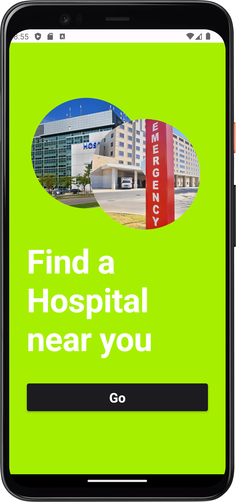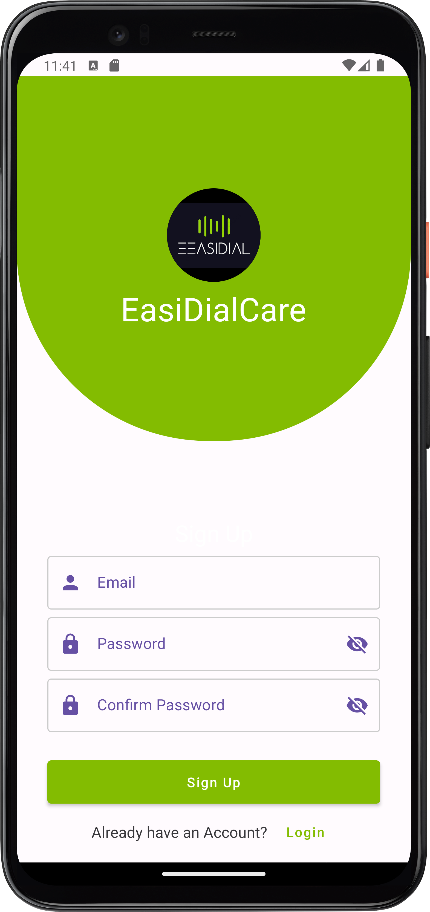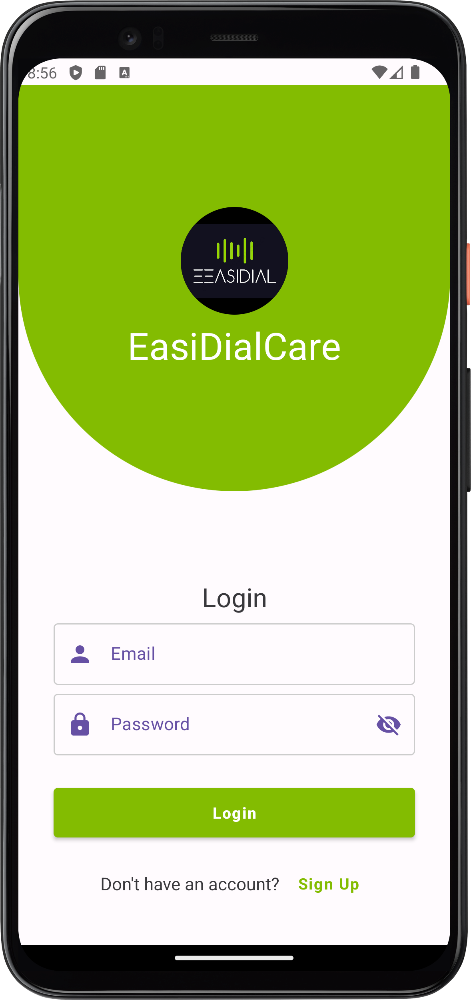

**Home**

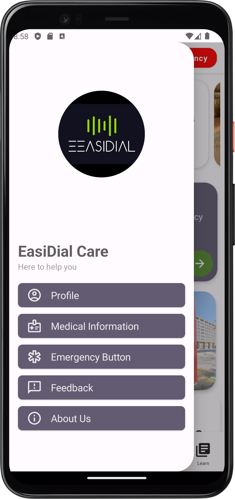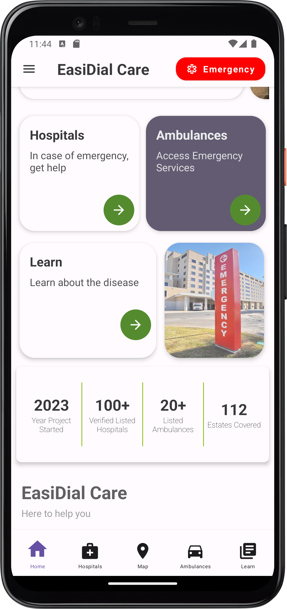

**Hospitals, Ambulances + Search Implementation**

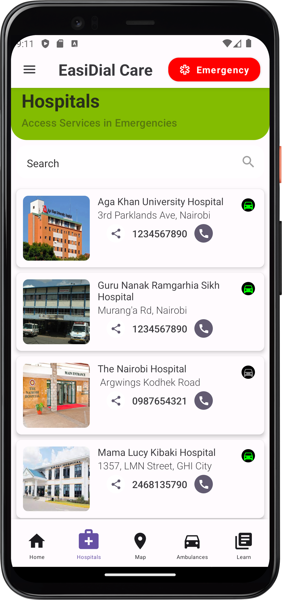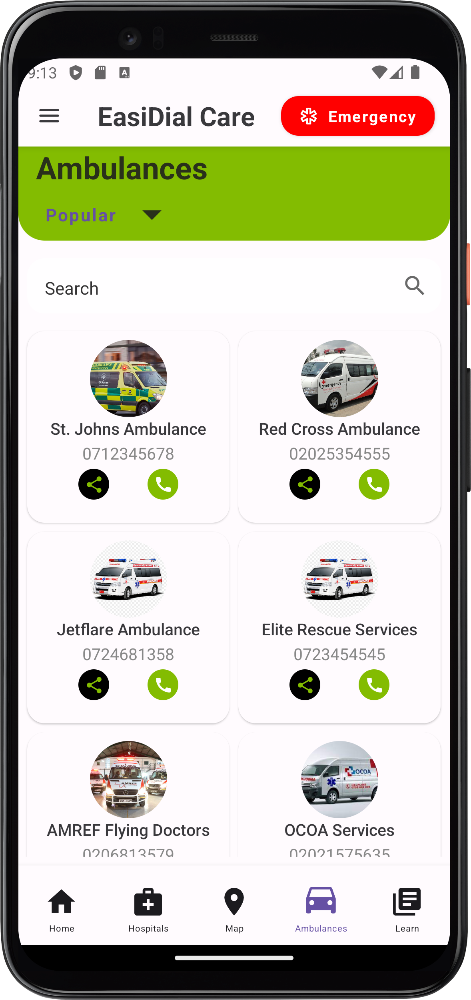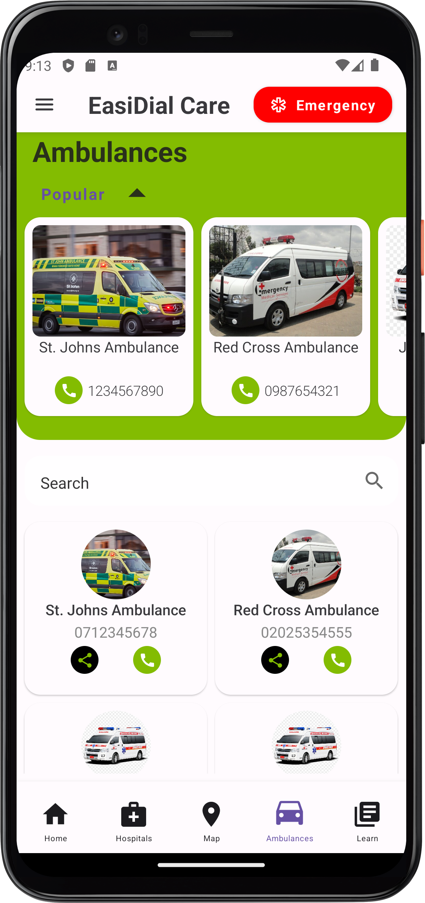

**Call[Opens Dial Pad] + Share[Open Share Options]**

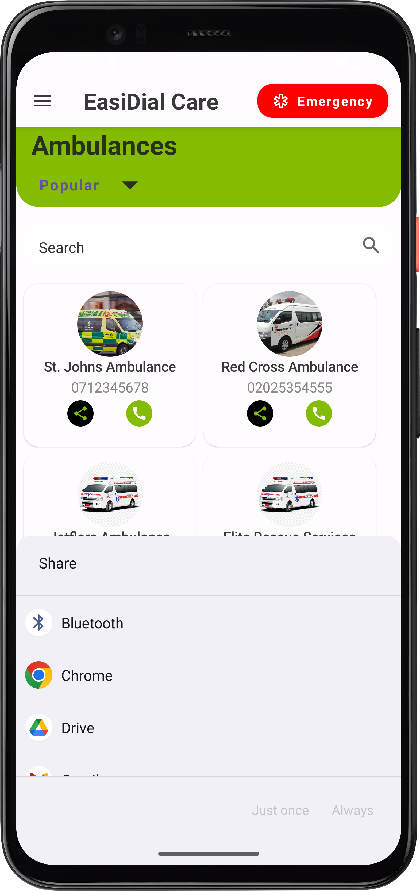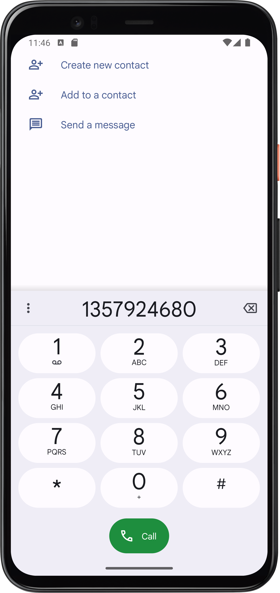

**Lessons + Search**

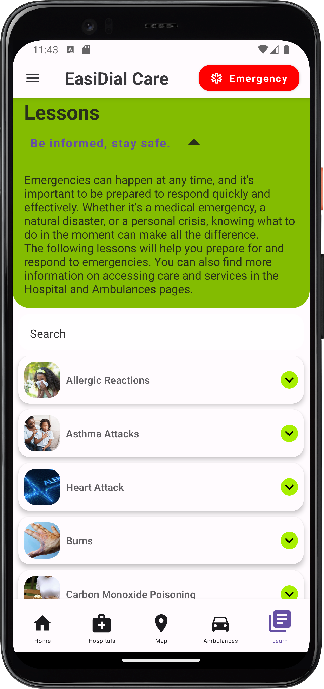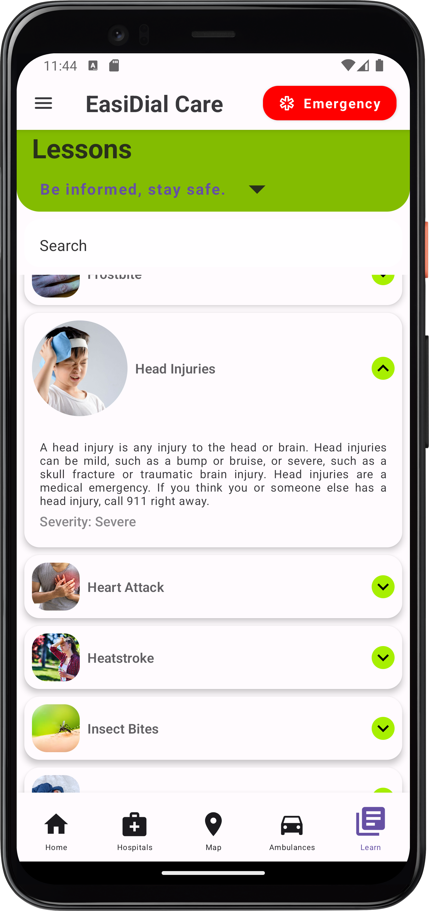


**Hospitals MapView**

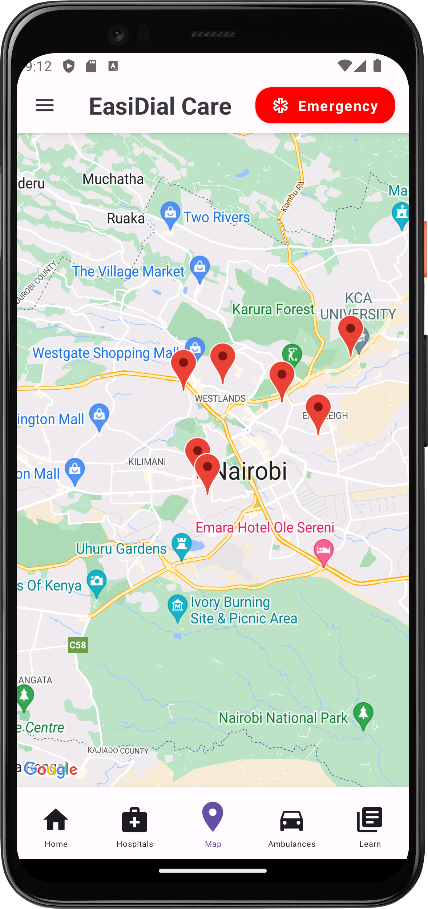


### Instructions for using the app

1. Clone or download the repository to your local machine.

   - Downloading the repository means downloading a **ZIP file** of the repository to your computer.
   - To download the repository, go to the repository's main page on GitHub and click on the "Code" button, then select "Download ZIP". This will download a compressed ZIP file containing the repository's code to your computer. You can then extract the ZIP file to a folder on your computer.
   - To clone the repository, you need to have Git installed on your computer, and you can use the following command in your terminal:

   ```kt
   git clone https://github.com/wakoliVotes/GoogleSolutionChallengeApp.git

   ```

2. Open Android Studio and select "**Open an existing Android Studio project**".
3. Navigate to the directory where you downloaded the repository and select the project's root folder.
4. Wait for Android Studio to build the project and sync all the dependencies.
5. Connect your Android device to your computer via USB or use an emulator.
6. Click on the "Run" button in Android Studio and select your device from the list.
7. Wait for the app to be installed on your device.
8. Once the app is installed, open it and follow the on-screen instructions to use the app.

**Note**:

- If you encounter any issues while building or running the app, please check these resources:
  - **[Android Studio](https://developer.android.com/studio)** homepage or
  - Jetbrain's **[Manage projects hosted on GitHub](https://www.jetbrains.com/help/idea/manage-projects-hosted-on-github.html)** for more help.
- If the problem persists, please feel free to **create a new issue** with a detailed description of the problem you're facing, along with screenshots (if possible) to help us diagnose the issue.
- We'll try our best to resolve the issue as soon as possible.

## Contributors

<!-- ALL-CONTRIBUTORS-LIST:START - Do not remove or modify this section -->
<!-- prettier-ignore-start -->
<!-- markdownlint-disable -->
<table>
  <tr>
<td align="center"><a href="https://github.com/wakoliVotes" target="_blank">
    <br /><sub><b>Votes Wakoli</b></sub></a><br />
    <a href="#" title="Code">💻</a>
    <a href="#" title="Documentation">📖</a>
    <a href="#" title="Design">🎨</a>
    <a href="#" title="Ideas, Planning, & Feedback">🤔</a>
    <a href="#" title="Maintenance">🚧</a>
    <a href="#" title="Project Management">📆</a>
    <a href="#" title="Tests">⚠️</a>    
    </td>
    <td align="center"><a href="https://github.com/Luchisoyi01" target="_blank">
      <br /><sub><b>Watson Luchisoyi</b></sub></a><br />
      <a href="#" title="Code">💻</a> 
      <a href="#" title="Design">🎨</a> 
      <a href="#" title="Ideas, Planning, & Feedback">🤔</a> 
      <a href="#" title="Review">👀</a> 
      <a href="#" title="Tests">⚠️</a></td>
   <td align="center"><a href="https://github.com/WendyGladys" target="_blank">
      <br /><sub><b>Wendy Gladys</b></sub></a><br />
      <a href="#" title="Code">💻</a> 
      <a href="#" title="Ideas, Planning, & Feedback">🤔</a> 
      <a href="#" title="Tests">⚠️</a></td>
<td align="center"><a href="https://github.com/SamuelWakoli" target="_blank">
<br /><sub><b>Samuel Wakoli</b></sub></a><br />
      <a href="#" title="Code">💻</a> 
      <a href="#" title="Design">🎨</a> 
      <a href="#" title="Ideas, Planning, & Feedback">🤔</a> 
      <a href="#" title="Tests">⚠️</a></td>
   </tr>
</table>

<!-- markdownlint-restore -->
<!-- prettier-ignore-end -->

<!-- ALL-CONTRIBUTORS-LIST:END -->

<!-- TO DO -->
<!-- 
If user opens the app and for the next 2 minutes no action is taken, the app should display a notification to the user with these conditions:
1. Ask use is there an emergency
2. If yes, then send message to emergency contacts
3. If no, return to screen
4. If no action is taken for 2 minutes, then send message to emergency contacts

5. If user is in an emergency, then the app should display a notification to the user with these conditions:
if user clicks onn the call button and no calls are made, the app should send a message to emergency contacts
 -->
